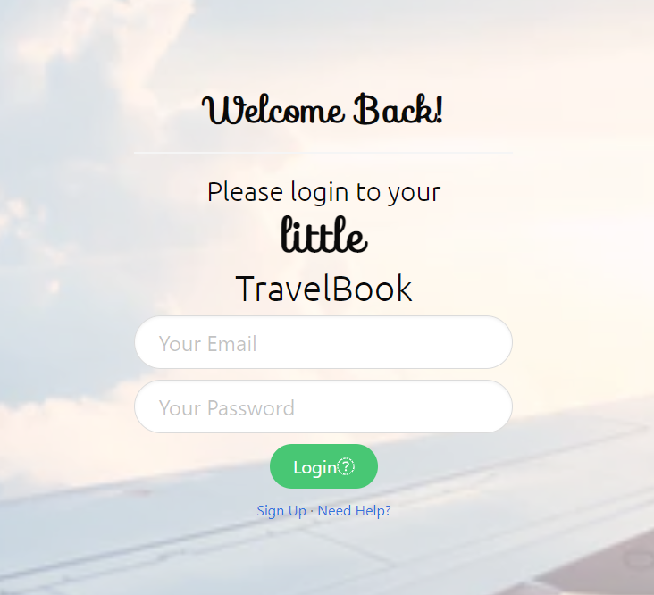
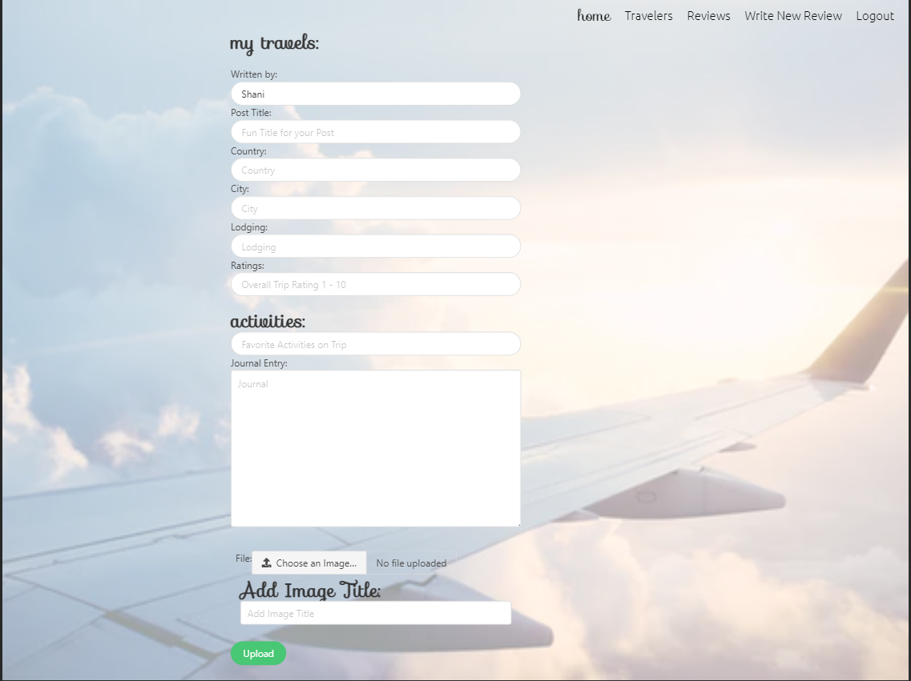

# Project2

## Description
    The little TravelBook is an app that allows users to sign in to their profile. They are able to write reviews about their trips and even share them with other users. 

    Here are some of the technologies that were used to the create this program:
    JavaScript,CSS,node.js,jQuery,inquirer,path,MySQL,Handlebars
    
## Table of Contents
* [Usage](#usage)
* [Contributing](#contributing)
* [Live_Links](#live_links)
* [Questions](#questions)
* [License](#license)
    
## Usage
    To give travelers a place to write and keep reviews and memories of their travels.

## Contributing
David Harris [GitHub](https://github.com/jdhprogrammer)

Michael Griffith [GitHub](https://github.com/GriffMike167)

Shani Black [GitHub](https://github.com/ShaniBlack)

## Live_Links
GitHub [link](https://github.com/ShaniBlack/Project2)

Deployed site [link](https://dashboard.heroku.com/apps/project-2-shani-michael-david)

## Questions
Please feel free to find me on GitHub: [ShaniBlack](https://github.com/ShaniBlack)
You can also [email](shaniblack2004@gmail.com) me with any questions.
    
## License
This application is covered by the MIT License license.
  
